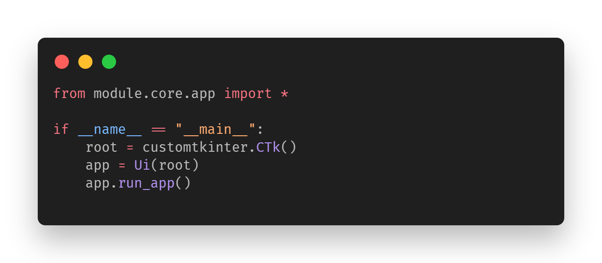
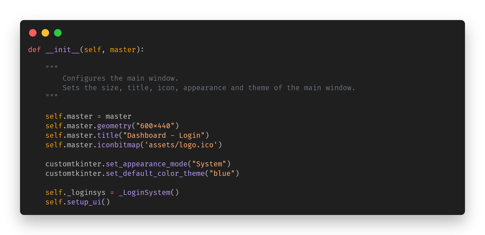
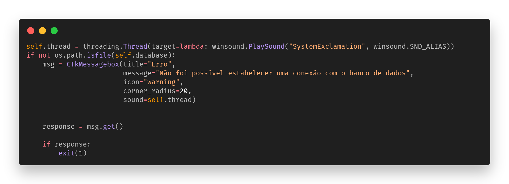

# Jamal Login System 💨


> Jamal Login System is a simple and functional login system. Written entirely in Python, using the CustomTkinter framework. Totally OpenSource to contribute to you who are studying the Software Engineering scene. 💫🥳

### Features!

> 'What can I find here?

- Database connection **(SQLite)**;
- Customized message boxes;
- Security methods, such as **SQL Injection**;
- Error handling with sound;
- Several checks;

> 'What awaits us?

- Home screen... 🎊

## 💻 Pre requisites

Before you start, check that you have met the following requirements:

- **Jamal was programmed in `<Python/3.12.0 Version>`** 
- You have installed the latest version of Python

- All <`.py`> files are documented within their own code.

## 🚀 Setting up 

To install, follow these steps:

```
$ pip install -r requirements.txt


--> 100%
```


## ☕ Using **Jamal**

-Start by initializing the main.py file.

- This is the main file, the code uses a modular structure,
separating the logic of the graphical interface into its own class



```
$ python main.py
```

And it will be running! ✨


## 🎡 Exploring archives




## 📝 License

This project is under license. See the [LICENSE](LICENSE.md) file for more details.